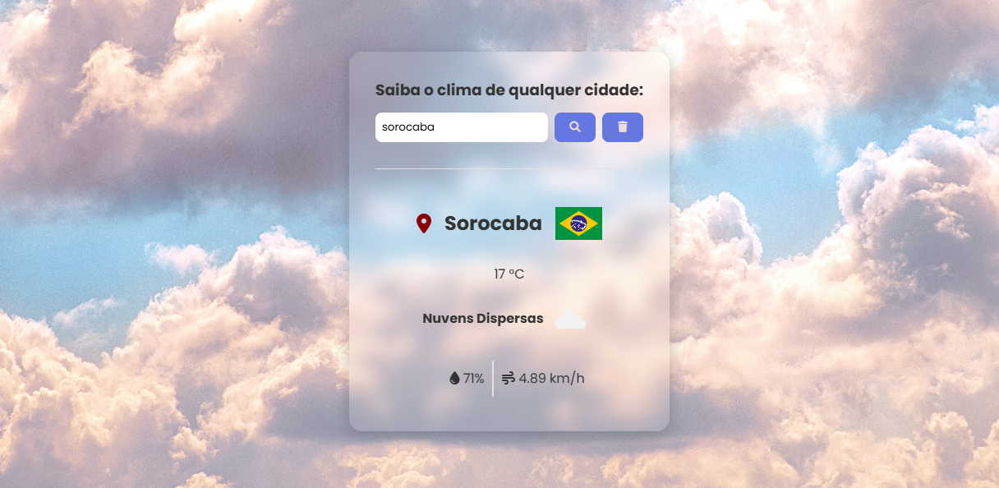

# 🌦️ Clima e Bandeiras

Projeto web que consome **duas APIs públicas** para exibir:

- Informações meteorológicas atuais de uma cidade
- Bandeira do país correspondente

---

## 🚀 Acesse o projeto online

🔗 [Clique aqui para acessar o site](https://viniciospereira-dev.github.io/clima-bandeiras/)

---

## 🧰 Tecnologias utilizadas

- HTML5
- CSS3
- JavaScript (JS)
- APIs REST:
  - [OpenWeatherMap](https://openweathermap.org/api) – Clima
  - [REST Countries](https://restcountries.com/) – Bandeiras e dados do país

---

## 🧠 Funcionalidades

- Campo de busca por cidade
- Consulta automática ao clima atual
- Exibição de:
  - Temperatura
  - Clima (ex: Nublado, Chuva, Limpo)
  - Nome do país
  - Bandeira do país
---

## 🖼️ Screenshot

Adicione uma imagem de demonstração (print) aqui se quiser:

